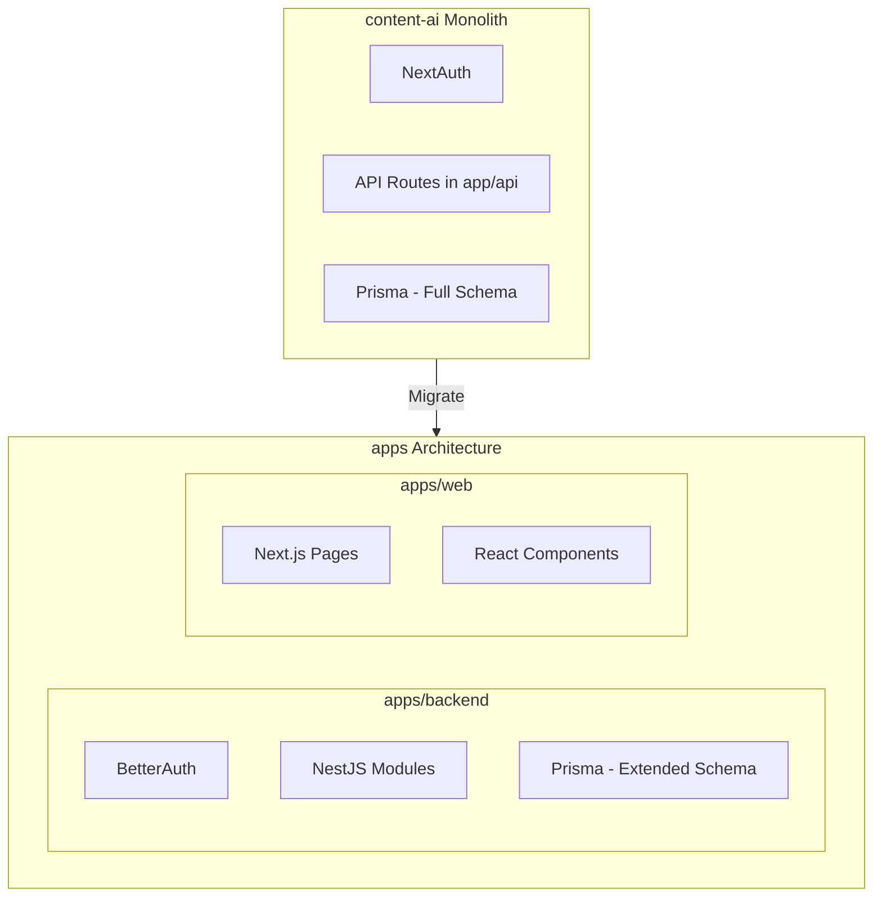

# Content-AI Monolith to Apps Architecture Migration Plan

## Current State Summary

### Old Monolith ([content-ai/](content-ai/))

- **Auth**: NextAuth v5 with email/password, 2FA, Twitter OAuth
- **Stack**: Next.js 15, Prisma (PostgreSQL + vector extension), API routes in `app/api/`
- **Integrations**: Facebook, LinkedIn, Twitter, Instagram OAuth for social posting
- **Workflows**: Upstash QStash for daily analytics fetch and scheduled post publishing

### New Architecture ([apps/](apps/))

- **Auth**: BetterAuth (migrated)
- **Backend**: NestJS at `apps/backend/` with modules: auth, onboarding, organization, stripe, users
- **Frontend**: Next.js at `apps/web/` with basic auth, onboarding, placeholder dashboard/campaign
- **Database**: Prisma schema with User, Organization, Onboarding, Subscription (subset of monolith models)

---

## Migration Architecture

---

## Phase 1: Database & Backend Foundation

### 1.1 Prisma Schema Extension

Extend [apps/backend/prisma/schema.prisma](apps/backend/prisma/schema.prisma) with models from [content-ai/prisma/schema.prisma](content-ai/prisma/schema.prisma):

| Model                                                        | Purpose                                           | Priority |
| ------------------------------------------------------------ | ------------------------------------------------- | -------- |
| `Integration`                                                | Social media OAuth connections (org-scoped)       | High     |
| `Schedule`                                                   | Scheduled posts (platform, content, date, status) | High     |
| `Campaign`                                                   | Campaign metadata and messages                    | High     |
| `CampaignMessage`                                            | Chat messages per campaign                        | High     |
| `File`, `Folder`                                             | Media storage (UploadThing)                       | High     |
| `KnowledgeBase`                                              | RAG/vector knowledge                              | High     |
| `Personality`                                                | Tone & writing style per org                      | High     |
| `BrandKit`                                                   | Colors, fonts, logo per org                       | Medium   |
| `FacebookAnalytics`, `TwitterAnalytics`, `LinkedinAnalytics` | Platform analytics                                | High     |
| `ImageChat`, `ImageChatMessage`                              | AI image generation chat                          | Medium   |
| `AIPricing`, `SubscriptionUsage`                             | Usage tracking                                    | Medium   |

**Enums to add**: `Platform` (TWITTER, LINKEDIN, FACEBOOK), `Status` (DRAFT, SCHEDULED, PUBLISHED), `UploadStatus`

**Note**: content-ai uses `organizationId` on Integration; apps backend uses `userId` for Subscription. Align on org-scoped resources.

### 1.2 Backend API Modules to Create

- **IntegrationModule** – OAuth URL generation, connect/disconnect, list accounts
- **CampaignModule** – CRUD campaigns, stream chat (or proxy to AI SDK)
- **ScheduleModule** – Create/update/delete schedules, post-now
- **MediaModule** – UploadThing webhook, file/folder CRUD
- **AnalyticsModule** – Fetch and serve Facebook/Twitter/LinkedIn analytics
- **PersonalityModule** – Tone & personality CRUD
- **KnowledgeModule** – Knowledge base CRUD, RAG
- **BrandKitModule** – Brand kit CRUD
- **WorkflowModule** – Proxies or handlers for QStash workflows (daily-analytics, post-scheduled-posts)

---

## Phase 2: Stripe & Subscription Completion

### 2.1 Stripe Webhook

- Implement `POST /api/stripe/webhook` in [apps/backend](apps/backend) (NestJS)
- Handle: `customer.subscription.deleted`, `customer.subscription.updated`, `invoice.paid`, `invoice.payment_failed`, `subscription_schedule.`
- Port logic from [content-ai/app/api/stripe/webhook/route.ts](content-ai/app/api/stripe/webhook/route.ts)
- Use `handleSubscriptionChange`, `handleResetUsageLimit`, `handleSubscriptionScheduleChange` equivalents

### 2.2 Stripe Checkout Session

- Backend endpoint to create checkout sessions (plan selection, credit purchase)
- Port from [content-ai/app/api/stripe/checkout/route.ts](content-ai/app/api/stripe/checkout/route.ts) for success redirect handling
- Ensure `client_reference_id` = userId for session creation

### 2.4 Credit Purchase Success

- `GET /api/stripe/credit-purchase-success` – Redirect handler after credit purchase checkout
- Port [content-ai/app/api/stripe/credit-purchase-success/route.ts](content-ai/app/api/stripe/credit-purchase-success/route.ts)
- Calls `handleCreditPurchaseSuccess(sessionId)` from `actions/credit-purchase.ts`

### 2.3 Plan & Subscription Pages

- **Plan page** (`/plan`): Port [content-ai/app/plan/page.tsx](content-ai/app/plan/page.tsx) – `PlanSelector`, `MagicBg`, Stripe prices
- **Subscription page** (`/subscription`): Port [content-ai/app/(dashboard)/subscription/page.tsx](<content-ai/app/(dashboard)/subscription/page.tsx>) – `SubscriptionManager`, `CreditBalanceManager`, `UsageTable`, `CreditPurchaseDialog`, `PlanChangeDialog`, `PlanExplorerDialog`

---

## Phase 3: Dashboard Layout & Shell

### 3.1 Dashboard Layout

- Create `(dashboard)` route group in `apps/web/app/(dashboard)/` with shared layout
- Port [content-ai/app/(dashboard)/layout.tsx](<content-ai/app/(dashboard)/layout.tsx>): `AppSidebar`, `SidebarProvider`, `CampaignHeader`, `TrialExpirationBanner`, `ExpirationBanner`, `AIRecommendations`
- Ensure `OrganizationProvider`, `SubscriptionProvider`, `IntegrationProvider`, `FileProvider` exist in apps (or equivalents)

### 3.2 Navigation & Sidebar

- Port [content-ai/components/nav/app-sidebar.tsx](content-ai/components/nav/app-sidebar.tsx)
- Port `OrganizationSwitcher`, `NavMain`, `NavUser`, `GuidedSetupSidebar` (setup progress: integrations, personality, company info)
- Update nav items: Campaign, Analytics, Schedule, Media, Settings (Integrations, Tone, Knowledge, Brand Kit)

### 3.3 Route Structure

| Old Route                   | New Route                              |
| --------------------------- | -------------------------------------- |
| `/campaign`                 | `/campaign`                            |
| `/campaign/[campaignId]`    | `/campaign/[campaignId]`               |
| `/analytics`                | `/analytics` (or merge with dashboard) |
| `/schedule`                 | `/schedule`                            |
| `/media`                    | `/media`                               |
| `/settings`                 | `/settings`                            |
| `/settings/integrations`    | `/settings/integrations`               |
| `/settings/tone`            | `/settings/tone`                       |
| `/settings/knowledge`       | `/settings/knowledge`                  |
| `/settings/brand`           | `/settings/brand`                      |
| `/account`                  | `/account` or `/settings/account`      |
| `/subscription`             | `/subscription`                        |
| `/plan`                     | `/plan`                                |
| `/integration`              | `/integration` (OAuth callback page)   |
| `/integration/confirmation` | `/integration/confirmation`            |

---

## Phase 4: Social Media Integration

### 4.1 OAuth Flow

- Backend: Integration OAuth URL endpoint (`POST /api/integration/oauth-url`)
- Backend: OAuth callback handlers for Facebook, LinkedIn, Twitter (exchange code for tokens, store in `Integration` table)
- Port [content-ai/lib/integration.ts](content-ai/lib/integration.ts) OAuth URL builders
- Port [content-ai/app/api/integration/facebook/route.ts](content-ai/app/api/integration/facebook/route.ts), `linkedin/route.ts`, `twitter/route.ts`, and `*/complete/route.ts`
- **Integration accounts** (`POST /api/integration/accounts`): Fetch user's Facebook pages, LinkedIn companies, Twitter user data – used during OAuth connect flow for account selection
- **Initial analytics** (`POST /api/integration/initial-analytics`): Fetch and store analytics when user first connects an integration

### 4.2 Integration Context & UI

- Port `IntegrationProvider`, `useIntegrations`, `useIntegratedAccounts`
- Port [content-ai/app/(dashboard)/settings/integrations/page.tsx](<content-ai/app/(dashboard)/settings/integrations/page.tsx>)
- Port `ConnectionButton`, `StatusBadge`, `ReconnectButton`, `ExpirationBanner`, `AccountSelector`
- Port [content-ai/app/integration/page.tsx](content-ai/app/integration/page.tsx) and `/integration/confirmation`
- Port [content-ai/lib/deauthorize.ts](content-ai/lib/deauthorize.ts) – `deauthorizePlatform()` for disconnect flow (Facebook, Twitter, LinkedIn, Instagram, Pinterest)

---

## Phase 5: Campaign Planning & Content Creation

### 5.1 Campaign API (Backend)

- `POST /api/campaign` – Create campaign, stream AI response (or proxy to external AI service)
- Port campaign agents: `create-campaign-agent`, `update-campaign-agent`, `research-agent`
- Port tools: `add-content-ideas-tool`, `delete-content-ideas-tool`, `create-campaign-tool`
- Port [content-ai/app/api/campaign/route.ts](content-ai/app/api/campaign/route.ts) and [content-ai/app/api/campaign/tools.ts](content-ai/app/api/campaign/tools.ts)
- **Challenge**: AI streaming in NestJS – consider keeping a thin Next.js API route that calls backend for auth, or use NestJS streaming response

### 5.2 Campaign Frontend

- Port [content-ai/app/(dashboard)/campaign/page.tsx](<content-ai/app/(dashboard)/campaign/page.tsx>) – `ChatForm`, `CampaignList`, `generateCampaignTitleAndDescription`
- Port [content-ai/app/(dashboard)/campaign/[campaignId]/page.tsx](<content-ai/app/(dashboard)/campaign/[campaignId]/page.tsx>) – `CampaignChat`, `CampaignPreview`
- Port campaign components: `campaign-chat.tsx`, `campaign-header`, `campaign-list`, `campaign-plan`, `campaign-preview`, `chat-form`, `schedule-post-popover`, `knowledge-sources`, etc.
- Port `CampaignPreviewProvider`, `useCampaignChatStore`
- Port platform previews: `twitter-preview`, `linkedin-preview`, `facebook-preview`
- Port `TwitterManualPost` – opens twitter.com/intent/tweet for manual posting (Twitter scheduling not supported)
- Port `TwitterScraper`, `YoutubeScraper` – campaign research tools

### 5.3 Content Generation API

- Port [content-ai/app/api/generate-content/route.ts](content-ai/app/api/generate-content/route.ts) – AI content generation with RAG, personality
- Port [content-ai/app/api/generate-image/route.ts](content-ai/app/api/generate-image/route.ts) – AI image generation (used in schedule MediaTab via `GenerateImage` component)
- Port [content-ai/app/api/improve-prompt/route.ts](content-ai/app/api/improve-prompt/route.ts), `improve-image-description/route.ts`
- **AI Image flow**: `GenerateImage`, `GenerateImageForm`, `ChatSelector`, `ChatItem`, `ImagePreferences`, `ImageDescriptionImprover` – embedded in schedule content creation for generating post media

---

## Phase 6: Schedule & Posting

### 6.1 Schedule API

- `POST /api/schedule` – Create schedule
- `PATCH /api/schedule/[scheduleId]` – Update
- `DELETE /api/schedule/[scheduleId]` – Delete
- `POST /api/schedule/post-now` – Immediate post
- Port [content-ai/app/api/schedule/route.ts](content-ai/app/api/schedule/route.ts) and related

### 6.2 Schedule Frontend

- Port [content-ai/components/schedule/calendar-view.tsx](content-ai/components/schedule/calendar-view.tsx)
- Port **ContentCreator** – full schedule creation flow with tabs:
  - `ContentCreator`, `ContentTab`, `MediaTab`, `PublishTab`, `PlatformSelector`, `ContentGenerator`, `DateTimePicker`, `SelectedMediaDisplay`, `StepIndicator`
- Port `PostCard`, `PostDisplay`, `PostDeleteDialog`
- Port `useMonthSchedules`, `useScheduleMutations` hooks
- **Note**: Twitter scheduling is manual – use `TwitterManualPost` (opens twitter.com/intent/tweet) for campaign content

### 6.3 Workflow – Post Scheduled Posts

- Port [content-ai/app/api/workflow/schedule/[...any]/route.ts](content-ai/app/api/workflow/schedule/[...any]/route.ts)
- Options: (a) Keep as Next.js API route (QStash calls it), or (b) Create NestJS endpoint and configure QStash to call backend URL
- Requires `postToFacebook`, `postToLinkedIn` (and Twitter if supported) – port from [content-ai/lib/facebook.ts](content-ai/lib/facebook.ts), [content-ai/lib/linkedin.ts](content-ai/lib/linkedin.ts)

---

## Phase 7: Dashboard & Analytics

### 7.1 Analytics API

- Backend endpoints to serve `FacebookAnalytics`, `TwitterAnalytics`, `LinkedinAnalytics` by date range and integration
- Port [content-ai/lib/analytics.ts](content-ai/lib/analytics.ts) – `fetchAnalyticsForIntegration`

### 7.2 Workflow – Daily Analytics

- Port [content-ai/app/api/workflow/analytics/[...any]/route.ts](content-ai/app/api/workflow/analytics/[...any]/route.ts)
- QStash cron triggers `daily-analytics` and `fetch-and-append-analytics`
- Option: NestJS endpoint or keep Next.js route for QStash

### 7.3 Dashboard Frontend

- Port [content-ai/components/dashboard/dashboard.tsx](content-ai/components/dashboard/dashboard.tsx)
- Port: `DatePickerWithRange`, `PlatformAnalytics`, `PlatformInsights`, `FollowerGrowthChart`, `TwitterEngagementChart`, `LinkedinEngagementChart`, `ReactionChart`, `OverviewMetrics`

---

## Phase 8: Media, Settings & Supporting Features

### 8.1 Media Storage

- Port [content-ai/app/api/uploadthing/route.ts](content-ai/app/api/uploadthing/route.ts) and [content-ai/app/api/uploadthing/core.ts](content-ai/app/api/uploadthing/core.ts)
- UploadThing can stay as Next.js route (or use UploadThing server SDK in NestJS)
- Port [content-ai/components/media/media-storage.tsx](content-ai/components/media/media-storage.tsx)
- Port `FileProvider`, `FileContext`

### 8.2 Settings – Tone & Personality

- Port [content-ai/app/(dashboard)/settings/tone/page.tsx](<content-ai/app/(dashboard)/settings/tone/page.tsx>)
- Port `Personality` CRUD, personality form components

### 8.3 Settings – Knowledge Base

- Port [content-ai/app/(dashboard)/settings/knowledge/page.tsx](<content-ai/app/(dashboard)/settings/knowledge/page.tsx>)
- Port KnowledgeBase CRUD, RAG/vector integration (Firecrawl, Upstash Vector)
- Port `components/knowledge/faq.tsx`, `components/knowledge/website-extraction/` (ExtractDialog, ContentDialog, ExtractionDeleteDialog, ExtractionRefreshButton, WebsiteExtractionSkeleton)

### 8.4 Settings – Brand Kit

- Port [content-ai/app/(dashboard)/settings/brand/page.tsx](<content-ai/app/(dashboard)/settings/brand/page.tsx>)
- Port [content-ai/components/brand-kit/brand-kit-manager.tsx](content-ai/components/brand-kit/brand-kit-manager.tsx) and related components

### 8.5 Account Settings

- Port [content-ai/app/(dashboard)/account/page.tsx](<content-ai/app/(dashboard)/account/page.tsx>)
- Port `GeneralSettingsForm`, `PasswordResetForm`, `AvatarEditor`

### 8.6 Settings Hub

- Fix [content-ai/app/(dashboard)/settings/page.tsx](<content-ai/app/(dashboard)/settings/page.tsx>) – links use `/assets/`_ but should be `/settings/`_

---

## Phase 9: Contexts, Hooks & Shared Logic

### 9.1 Contexts to Port

| Context                   | Purpose                         |
| ------------------------- | ------------------------------- |
| `IntegrationProvider`     | Social account connection state |
| `SubscriptionProvider`    | Plan, credits, trial state      |
| `FileProvider`            | Media file state                |
| `CampaignPreviewProvider` | Campaign preview panel state    |
| `StickToBottomContext`    | Chat scroll behavior            |

### 9.2 Hooks to Port

- `useCampaignChatStore`, `useCurrentUser` (adapt for BetterAuth session)
- `useIntegratedAccounts`, `useIntegrations`
- `useUploadThing` (UploadThing React hook)
- `useMonthSchedules`, `useScheduleMutations`, `usePrefetchFiles`, `useInfiniteFiles`
- `useDashboardData`, `useKnowledgeMutations`, `useKnowledgeQuery`, `usePersonalityMutations`, `usePersonalityQuery`
- `useBrandKit`, `useImageChatStore`, `useAIRecommendation`, `useConfetti`, `useListScroll`, `useLockBody`, `useMobile`

### 9.3 Actions to Port

- `actions/campaign.ts`, `actions/integration.ts`, `actions/subscription.ts`, `actions/usage.ts`
- `actions/brand-kit.ts`, `actions/personality.ts`, `actions/settings.ts`, `actions/file.ts`
- `actions/website-extraction.ts`, `actions/credit-purchase.ts`, `actions/dashboard.ts`

---

## Phase 10: AI Elements, UI & Polish

### 10.1 AI Components

- Port `components/ai-elements/` (artifact, conversation, message, tool, etc.) if used by campaign chat
- Port `AIRecommendations` component

### 10.2 UI Components

- Ensure all Shadcn/Radix components used in content-ai exist in apps/web
- Port `magic-bg`, `magic-shadow`, `DashboardShell`
- Port `TrialExpirationBanner`, `ExpirationBanner`

### 10.3 Constants & Config

- Port `constants/providers.ts` (Facebook, LinkedIn, Twitter; Instagram/Pinterest commented out)
- Port `constants/prompt.ts` (DEFAULT_PERSONALITY, etc.), `constants/font-categories.ts`, `constants/platform-images.tsx`
- Port `lib/validations/schedule.ts`, `lib/error-handling.ts`, `lib/validations/brand-kit.ts`, `personality.ts`, `file.ts`, `website-extraction.ts`, `faq.ts`, `user.ts`, `password.ts`, `onboarding.ts`
- Port `lib/openrouter.ts`, `lib/stripe.ts`, `lib/subscription.ts`
- Port `lib/analytics.ts`, `lib/facebook.ts`, `lib/linkedin.ts`, `lib/twitter.ts`, `lib/linkedin-formatter.ts`
- Port `lib/vector-client.ts` (RAG/Upstash Vector), `lib/firecrawl.ts` (website extraction), `lib/ai-cost.ts`, `lib/redis.ts`, `lib/workflow.ts`, `lib/timezone.ts`, `lib/crop.ts`, `lib/upload-from-url.ts`, `lib/retry.ts`, `lib/tokens.ts`
- Port `types/campaign.ts`, `types/campaign-update.ts`, `types/integration.ts`, `types/setup.ts`

---

## Phase 11: Middleware & Auth Alignment

### 11.1 Middleware

- Port [content-ai/middleware.ts](content-ai/middleware.ts) logic to apps/web
- Ensure `isTrialActive`, `hasCustomerId`, `isOnboardingCompleted` from session (BetterAuth callbacks)
- Redirect flows: no trial/customer → `/plan`; no onboarding → `/onboard`; both done → `/campaign`

### 11.2 Session Shape

- Ensure BetterAuth session includes: `organizationId`, `isTrialActive`, `hasCustomerId`, `isOnboardingCompleted`
- Backend may need to extend session via JWT callback or database lookup

---

## Migration Checklist (Summary)

| #   | Area                                       | Status  | Notes                                     |
| --- | ------------------------------------------ | ------- | ----------------------------------------- |
| 1   | Auth & Onboarding                          | Done    | BetterAuth, onboarding wizard             |
| 2   | Organizations                              | Done    | CRUD, plan limits                         |
| 3   | Prisma schema extension                    | Pending | Integration, Schedule, Campaign, etc.     |
| 4   | Stripe webhook                             | Pending | Subscription lifecycle                    |
| 5   | Stripe checkout session creation           | Pending | Backend endpoint                          |
| 6   | Plan page                                  | Pending | PlanSelector, MagicBg                     |
| 7   | Subscription page                          | Pending | SubscriptionManager, credits, usage       |
| 8   | Dashboard layout & sidebar                 | Pending | AppSidebar, route group                   |
| 9   | Integration OAuth (FB, LI, TW, IG)         | Pending | Backend + frontend                        |
| 10  | Settings – Integrations page               | Pending | Connection UI                             |
| 11  | Campaign API & agents                      | Pending | Streaming, tools                          |
| 12  | Campaign frontend                          | Pending | Chat, list, preview                       |
| 13  | Generate content API                       | Pending | AI + RAG                                  |
| 14  | Schedule API & calendar                    | Pending | CRUD, calendar view                       |
| 15  | Workflow – post scheduled                  | Pending | QStash + FB/LI posting                    |
| 16  | Analytics API & workflow                   | Pending | Fetch, store, serve                       |
| 17  | Dashboard analytics UI                     | Pending | Charts, metrics                           |
| 18  | Media/UploadThing                          | Pending | File upload, storage UI                   |
| 19  | Settings – Tone, Knowledge, Brand, Account | Pending | All sub-pages                             |
| 20  | Contexts & hooks                           | Pending | Integration, Subscription, File, Campaign |
| 21  | Middleware & session                       | Pending | Trial, onboarding redirects               |

---

## Recommended Migration Order

1. **Phase 1** – Schema + core backend modules (Integration, Schedule, Campaign)
2. **Phase 2** – Stripe completion (webhook, checkout, plan/subscription pages)
3. **Phase 3** – Dashboard layout, sidebar, route structure
4. **Phase 4** – Social integrations (OAuth, settings page)
5. **Phase 5** – Campaign (API + frontend)
6. **Phase 6** – Schedule + workflow
7. **Phase 7** – Analytics + dashboard UI
8. **Phase 8** – Media, settings sub-pages
9. **Phase 9–11** – Contexts, polish, middleware

---

## Key Files Reference

**content-ai (source)**:

- Layout: `app/(dashboard)/layout.tsx`, `app/layout.tsx`
- Auth: `auth.config.ts`, `auth.ts`, `lib/auth.ts`
- API: `app/api/campaign/`, `app/api/schedule/`, `app/api/integration/`, `app/api/stripe/`, `app/api/workflow/`, `app/api/generate-content/`, `app/api/uploadthing/`
- Lib: `lib/db.ts`, `lib/integration.ts`, `lib/analytics.ts`, `lib/facebook.ts`, `lib/linkedin.ts`, `lib/stripe.ts`, `lib/subscription.ts`
- Contexts: `contexts/integration-context.tsx`, `contexts/subscription-context.tsx`, `contexts/file-context.tsx`, `contexts/campaign-preview-context.tsx`

**apps (target)**:

- Backend: `apps/backend/src/` (add new modules)
- Frontend: `apps/web/app/`, `apps/web/components/`, `apps/web/contexts/`
- Config: `apps/web/next.config.ts` (API rewrites to backend)
